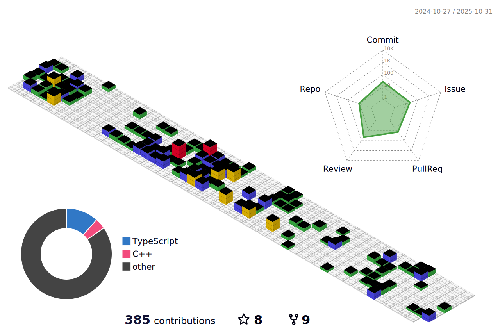

## Hi, Nice to see you here! 

- Currently CTO at [Drone Geofencing](https://drone-geofencing.fr)
- CEO of an IT services company: [Cornerstone](https://corner-stone.ai)
- ☕️ Ping me for **interim management**, **team management**, **web development**, **development**, **application development**
- 📫 Reach me: [email](mailto:marionantony@proton.me)

### Some of my most used languages, but open to learn new ones

### Some of my most used technologies, but open to learn new ones

### Stats

